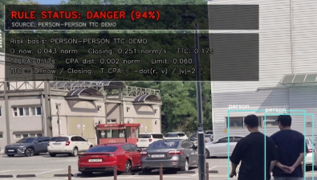

# 교통사고 예측 시스템
YOLOv11과 Trajectory Transformer를 결합한 실시간 교통사고 예측 시스템입니다.

---

# 프로젝트 개요

국내 교통사고 사망자 중 보행자 비율은 36.5%로 가장 높은 비중을 차지하고 있습니다.

본 프로젝트는 보행자의 돌발 차도 진입과 같은 위험 상황을 사전에 감지하고,
충돌까지 남은 시간을 실시간으로 예측하여 사고를 선제적으로 예방하는 것을 목표로 합니다.

> 출처: 한국도로교통공단, 「최근 교통사고 통계 분석 및 보행자 안전 현황」 보도자료, 2024

---

## 프로젝트 정보    

| 항목 | 내용 |
|:----:|:-----|
| 개발 기간 | 2025.04.20 ~ 2025.06.22 |
| 팀 구성 | 4인 팀 프로젝트 |
| 개발 환경 | Python 3.x, CPU 기반 |


# 법적 근거

*법적 당위성*

국가 및 지자체는 공공 교통의 효율화와 안전 확보를 위해 지능형 교통체계(ITS)를
구축·운영해야 할 법적 의무를 지닙니다. 본 시스템은 이에 부합하는 방식으로 설계되었습니다.

- 근거: 대한민국 법제처 「국가통합교통체계효율화법」 제77조

*데이터 적법성*

교통정보 수집을 목적으로 하는 고정형 카메라는 법적으로 허용됩니다.
본 시스템은 실시간 비식별 좌표 데이터만을 처리하므로 개인정보 보호 규정을 준수합니다.

- 근거: 대한민국 법제처 「개인정보 보호법」 제25조

---

# 참고 논문 및 차별점

*참고 논문*

> Yang, J., & Hong, T. (2026). An Improved YOLOv11-Based Method for Near-Miss Accident Detection at Urban Intersections. *MDPI.*

*파이프라인 비교*

기존 논문은 현재 위치를 기반으로 등속도 직선 운동을 가정하여 TTC를 계산하는 방식입니다.
반면 본 프로젝트는 Trajectory Transformer를 통해 1~2초 후의 미래 위치를 예측하고,
이를 기반으로 TTC를 산출함으로써 실질적인 사전 경보 시간을 확보합니다.

기존 논문: YOLO → 호모그래피(BEV) → 등속도 직선 TTC 계산 → 위험도 출력
본 프로젝트: YOLOv11 → 호모그래피(BEV) → Trajectory Transformer → TTC/T_CPA/CPA Distance → 위험도 출력

*세부 비교*

| 비교 항목 | 기존 논문 (MDPI 2026) | 본 프로젝트 |
|:---------:|:---------------------:|:-----------:|
| 경로 예측 | 없음 | Trajectory Transformer |
| TTC 계산 방식 | 등속도 직선 가정 | 비선형 미래 경로 기반 |
| 위험도 지표 | 단일 TTC | TTC + T_CPA + CPA Distance |
| 예측 기준 | 현재 위치 기반 | 1~2초 후 미래 위치 기반 |
| BEV 변환 | 4점 호모그래피 | 6점 폴리곤 (왜곡 개선) |
| 핵심 방식 | 사후 감지 | 선제적 예측 |

---

# 시스템 파이프라인

카메라 영상

↓

YOLOv11 — 차량, 보행자, 신호등 등 객체 검출

↓

호모그래피 BEV 변환 — 3D 원근 영상을 2D 버드아이뷰로 변환 (6점 폴리곤)

↓

Trajectory Transformer — 과거 20프레임을 학습하여 미래 10프레임 위치 예측

↓

위험도 계산 — TTC, T_CPA, CPA Distance 기반 충돌 시간 및 거리 산출

↓

실시간 시각화 — SAFE / CAUTION / WARNING / DANGER 4단계 위험도 출력

---

# 사용 기술

| 분류 | 기술 |
|:----:|:----:|
| 데이터 전처리 | Roboflow |
| 객체 검출 | YOLOv11 |
| 좌표 변환 | 호모그래피 (6점 폴리곤 BEV) |
| 경로 예측 | Trajectory Transformer |
| 위험도 계산 | TTC, T_CPA, CPA Distance |

---

# 모델 성능

| 지표 | 값 |
|:----:|:--:|
| Precision | 70.8% |
| Recall | 64.8% |
| mAP50 | 61.3% |
| mAP50-95 | 41.7% |
| Transformer Validation Loss | 0.2956 |

---

## 시연 화면



<video src="https://github.com" controls width="100%"></video>


RULE STATUS: DANGER (94%) — 보행자 간 TTC 0.17초 감지 상황

---


# 위험도 기준

| 등급 | 조건 | 색상 |
|:----:|:----:|:----:|
| SAFE | TTC > 5초 | 초록 |
| CAUTION | 3초 < TTC ≤ 5초 | 노랑 |
| WARNING | 1.5초 < TTC ≤ 3초 | 주황 |
| DANGER | TTC ≤ 1.5초 | 빨강 |

---

# 데이터셋

- *공식 데이터*: Kaggle, 도로 CCTV 영상
- *실측 데이터*: 육교 위 자체 촬영 영상 및 보행자 충돌 상황 자체 촬영
- *전처리*: Roboflow를 통한 라벨링 및 Detection 수행
- *학습 규모*: 1,096장 (train / validation)
- *학습 설정*: YOLOv11 기반, epoch 60 반복 학습

---

# 주요 기여

- 선행 논문 분석 및 개선 방향 도출
- YOLOv11 → BEV → Transformer → TTC 전체 파이프라인 설계 및 구현
- 실측 데이터 직접 촬영 및 Roboflow Labeling & Detection 수행
- 4점 호모그래피에서 6점 폴리곤 방식으로 개선하여 BEV 왜곡 감소
- TTC 정량 검증 수행 (역산 계산을 통해 출력값과 수치 일치 확인)

---

# 실행 방법

*1. 패키지 설치*

```bash
pip install ultralytics opencv-python torch numpy pandas
```

*2. 실행*

```bash
python main.py
```

*3. 모드 선택*

| 모드 | 설명 |
|:----:|:-----|
| `normal` | 정상 scene 데이터 수집 모드 |
| `demo` | 실시간 AI 시연 모드 |


